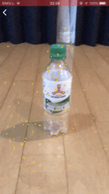
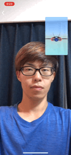
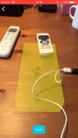

    
 
 
A long time ago in a galaxy, far, far away...

It is a period when iPhone SE and iPhone X were destroyed from the apple store, the AR market was under pressure by the Pokemon GO. 

During the Battle, Rebel spies managed to steal the data of the secret plans of ARKit 2.0...

# What's this?

This is the dark side of [ARKit-Sampler](https://github.com/shu223/ARKit-Sampler).

The Emperor give you the most practical ARKit samples ever.

**Unlimited power for ARKit!**

# Samples

## Doodle (ARKit 1.0~)

You can draw to the real space!

This sample code's perfomance is not perfect becase it adds a new node every time your finger moves. The best way I know is adding node only when you start touching screen and update it's geometry during moving your finger. Please refer the [Just a line](https://justaline.withgoogle.com/) code.

The code is [here](https://github.com/kboy-silvergym/ARKit-Emperor/tree/master/ARKit-Emperor/View/Doodle)

## Placing pictures (ARKit 1.0~)

Place your photo into the picture frame. You can make picture frames on SceneKit.

The code is [here](https://github.com/kboy-silvergym/ARKit-Emperor/tree/master/ARKit-Emperor/View/Picture)

## Rich Plane Detection (ARKit 1.5~)

The plane detection can be available by ARKit 1.0, but this richer detection is available by 1.5.

The code is [here](https://github.com/kboy-silvergym/ARKit-Emperor/tree/master/ARKit-Emperor/View/PlaneDetection)

## Face (ARKit 1.0~)

By ARKit2.0, you can detect also gaze and tongue. This demo is using tongue detection.

The code is [here](https://github.com/kboy-silvergym/ARKit-Emperor/tree/master/ARKit-Emperor/View/Face)

## Persistent Memo (ARKit 2.0~)

Using ARKit 2.0, you can save ARWorldMap and load it.

The code is [here](https://github.com/kboy-silvergym/ARKit-Emperor/tree/master/ARKit-Emperor/View/Memo)

## Mirror (ARKit 2.0~)

Using ARKit 2.0, It's not perfect but the object reflect around the environment.

The code is [here](https://github.com/kboy-silvergym/ARKit-Emperor/tree/master/ARKit-Emperor/View/Mirror)

## Business Card (ARKit 2.0~)

|Show|Tap|
|:-:|:-:|
|||

Augmented business card. If you register the image of your card, ARKit2.0 detects it and the 3D component made in SceneKit can be shown.

If you get the error (`Make sure that all reference images are greater than 100 pixels and have a positive physical size in meters.`), check [the stack overflow](https://stackoverflow.com/questions/49006651/invalid-reference-image-arkit-1-5).

The code is [here](https://github.com/kboy-silvergym/ARKit-Emperor/tree/master/ARKit-Emperor/View/BusinessCard)

## Detecting your Remote (ARKit 2.0~)

Using ARKit 2.0,  now you can scan 3D object.

The code is **WIP**. Wait a few days to be completed..

# Author

**KBOY (Kei Fujikawa)**

iOS Developer in Tokyo Japan, working on AR startup named [Graffity Inc.](https://www.graffity.jp/)

- [Twitter](https://twitter.com/kboy_silvergym) / [Facebook](https://www.facebook.com/kei.fujikawa1)
- [LinkedIn](https://www.linkedin.com/in/kei-fujikawa) / [Wantedly](https://www.wantedly.com/users/17820205)

# Special Thanks

The thumbnail is designed by [@shujihirai](https://twitter.com/shujihirai)
