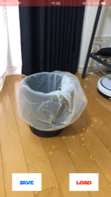
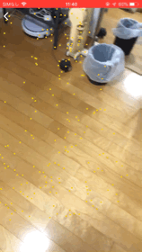

    
 

# What's this?

This is the dark side of [ARKit-Sampler](https://github.com/shu223/ARKit-Sampler).

The Emperor give you the most practical ARKit samples ever.

**Unlimited power for ARKit!**

# Samples

## Doodle

Doodle is basic ARKit development used by [Just a line](https://justaline.withgoogle.com/), [Graffity](https://itunes.apple.com/app/id1277452876?mt=8) which is our company's work.

**WIP**

## Placing pictures

Place your pthoto into the picture frame. You can make picture frames on SceneKit.

The code is [here](https://github.com/kboy-silvergym/ARKit-Emperor/tree/master/ARKit-Emperor/View/Picture)

## Persistent Memo

Using ARKit 2.0, you can save ARWorldMap and load it.

The code is [here](https://github.com/kboy-silvergym/ARKit-Emperor/tree/master/ARKit-Emperor/View/Memo)

## Detecting your Remote

Using ARKit 2.0,  now you can detect 3D object.

**WIP**

## Mirror

Using ARKit 2.0, It's not perfect but the object reflect around the environment.

The code is [here](https://github.com/kboy-silvergym/ARKit-Emperor/tree/master/ARKit-Emperor/View/Mirror)

## Business Card

|Show|Tap|
|:-:|:-:|
|||

Augmented business card. If you register the image of your card, ARKit2.0 detects it and the 3D component made in SceneKit can be shown.

If you get the error (`Make sure that all reference images are greater than 100 pixels and have a positive physical size in meters.`), check [the stack overflow](https://stackoverflow.com/questions/49006651/invalid-reference-image-arkit-1-5).

The code is [here](https://github.com/kboy-silvergym/ARKit-Emperor/tree/master/ARKit-Emperor/View/BusinessCard)

## Face

Using ARKit2.0, you can detect not only eyes, nose, mouse, but also gaze.

**WIP**

# Author

**KBOY (Kei Fujikawa)**

iOS Developer in Tokyo Japan, working on AR startup named [Graffity Inc.](https://www.graffity.jp/)

- [Twitter](https://twitter.com/kboy_silvergym) / [Facebook](https://www.facebook.com/kei.fujikawa1)
- [LinkedIn](https://www.linkedin.com/in/kei-fujikawa) / [Wantedly](https://www.wantedly.com/users/17820205)
