    
 
 
A long time ago in a galaxy, far, far away...

It is a period when iPhone SE and iPhone X were destroyed from the apple store, the AR market was under pressure by the Pokemon GO. 

During the Battle, Rebel spies managed to steal the data of the secret plans of ARKit 2.0...

# What's this?

This is the dark side of [ARKit-Sampler](https://github.com/shu223/ARKit-Sampler).

The Emperor give you the most practical ARKit samples ever.

**Unlimited power for ARKit!**

# Samples

## Practice

|Place infront of camera|Place same Y with Camera|Place in front of tapped|Place to plane|
|:--:|:--:|:--:|:--:|
|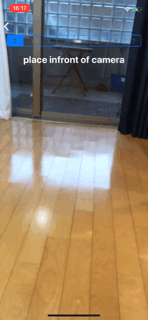|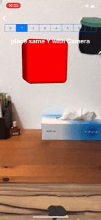|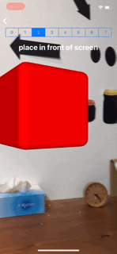|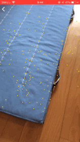|

|Look at me|Look as same with me|Shoot|Hold|
|:--:|:--:|:--:|:--:|
|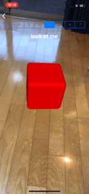|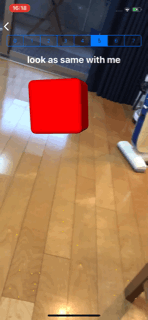||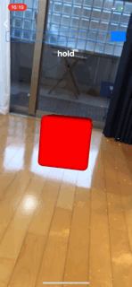|

The code is [here](https://github.com/kboy-silvergym/ARKit-Emperor/tree/master/ARKit-Emperor/View/Practice)

## Gesture

|Scale|Rotation|
|:--:|:--:|
|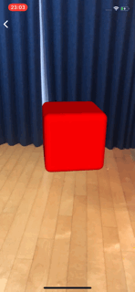||

The code is [here](https://github.com/kboy-silvergym/ARKit-Emperor/tree/master/ARKit-Emperor/View/Gesture)

## Doodle

You can draw to the real space! This sample code is very simple but perfomance is not perfect because it adds a new node every time your finger moves. 

The code is [here](https://github.com/kboy-silvergym/ARKit-Emperor/tree/master/ARKit-Emperor/View/Doodle)

## Doodle2

This sample is better than `Doodle1`  because the geometry is created once each line. If you customize the vertices and indices logic, you can create any line you want. But the logic is so complicated.

The code is [here](https://github.com/kboy-silvergym/ARKit-Emperor/tree/master/ARKit-Emperor/View/Doodle2)

## Custom 3D Model from Bezier Path

You can create 3D model by code using bezier path

The code is [here](https://github.com/kboy-silvergym/ARKit-Emperor/tree/master/ARKit-Emperor/View/CustomModel)

## Placing pictures

Place your photo into the picture frame. You can make picture frames on SceneKit.

The code is [here](https://github.com/kboy-silvergym/ARKit-Emperor/tree/master/ARKit-Emperor/View/Picture)

## SCNAction

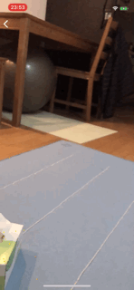

Use SCNAction to  your object appeares more naturally.

The code is [here](https://github.com/kboy-silvergym/ARKit-Emperor/tree/master/ARKit-Emperor/View/Action)

## Color Grading

|||||
|:-:|:-:|:-:|:-:|
|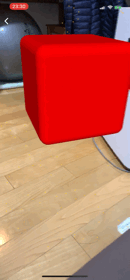|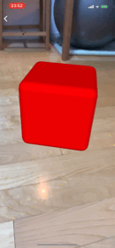||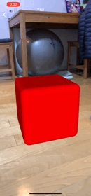|

You can make camera fileter using a LUT image.

The code is [here](https://github.com/kboy-silvergym/ARKit-Emperor/tree/master/ARKit-Emperor/View/ColorGrading)

## Rich Plane Detection (ARKit 1.5~)

|horizontal|vertical|
|:--:|:--:|
||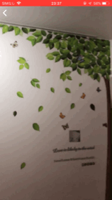|

The plane detection can be available by ARKit 1.0, but this richer detection is available by 1.5.

The code is [here](https://github.com/kboy-silvergym/ARKit-Emperor/tree/master/ARKit-Emperor/View/PlaneDetection)

And you can implement simple occlusion like below.

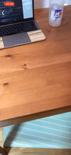

## Face

By ARKit2.0, you can detect also gaze and tongue. This demo is using tongue detection.

The code is [here](https://github.com/kboy-silvergym/ARKit-Emperor/tree/master/ARKit-Emperor/View/Face)

## Persistent Memo (ARKit 2.0~)

Using ARKit 2.0, you can save ARWorldMap and load it.

The code is [here](https://github.com/kboy-silvergym/ARKit-Emperor/tree/master/ARKit-Emperor/View/Memo)

## Mirror (ARKit 2.0~)

Using ARKit 2.0, It's not perfect but the object reflect around the environment.

The code is [here](https://github.com/kboy-silvergym/ARKit-Emperor/tree/master/ARKit-Emperor/View/Mirror)

## Business Card (ARKit 2.0~)

|Show|Tap|
|:-:|:-:|
|||

Augmented business card. If you register the image of your card, ARKit2.0 detects it and the 3D component made in SceneKit can be shown.

If you get the error (`Make sure that all reference images are greater than 100 pixels and have a positive physical size in meters.`), check [the stack overflow](https://stackoverflow.com/questions/49006651/invalid-reference-image-arkit-1-5).

The code is [here](https://github.com/kboy-silvergym/ARKit-Emperor/tree/master/ARKit-Emperor/View/BusinessCard)

## Detecting your Remote (ARKit 2.0~)

Using ARKit 2.0,  now you can scan 3D object.

The code is **WIP**. Wait a days to be completed..

Note that the Apple doesn't recommend you to use ARObjectScanningConfiguration for production use.

>ARObjectScanningConfiguration is for use only in development scenarios. High-fidelity spatial mapping has a high performance and energy cost, and disables ARKit features not necessary for reference object scanning. To produce AR experiences for end users, use ARWorldTrackingConfiguration. https://developer.apple.com/documentation/arkit/arobjectscanningconfiguration

# Author

**KBOY (Kei Fujikawa)**

iOS Developer in Tokyo Japan, working on AR startup named [Graffity Inc.](https://www.graffity.jp/)

- [Twitter](https://twitter.com/kboy_silvergym) / [Facebook](https://www.facebook.com/kei.fujikawa1)
- [LinkedIn](https://www.linkedin.com/in/kei-fujikawa) / [Wantedly](https://www.wantedly.com/users/17820205)

# Special Thanks

The thumbnail is designed by [@shujihirai](https://twitter.com/shujihirai)
